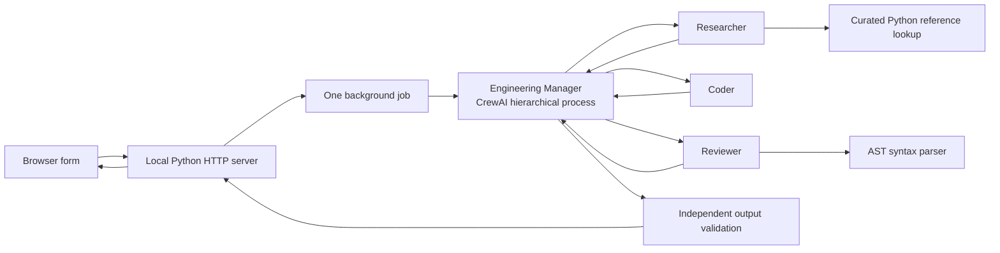

# How DevRelay Crew works

## The whole path

The browser does not call Gemini directly. It sends a request to a Python server listening only on `127.0.0.1`. The server starts the CrewAI job in another thread and gives the browser a run ID. The browser polls `/api/runs/<id>` for events and the result. The API key is held in the worker's memory for the run and is never included in the status response.

## The manager and specialists

The **Engineering Manager** is a real CrewAI manager agent configured with `Process.hierarchical`. It receives three tasks in order: research, coding, then review. CrewAI gives the manager delegation tools to select the matching specialist, supplies prior task outputs as context, and lets the manager evaluate the work. The workers cannot delegate further.

The **Researcher** has one custom tool, `lookup_python_reference`. It searches eight small reference cards whose URLs point to official Python documentation. This keeps the research reproducible and avoids needing another search API key. It is intentionally narrower than open-web research.

The **Coder** has no filesystem or execution tool. It proposes complete source and `unittest` code as text. Its output becomes context for the review task.

The **Reviewer** has a `check_python_syntax` tool. That tool calls `ast.parse`, which checks Python grammar without executing code. The reviewer must check both proposed files and discuss missing cases or limitations. The final task uses a Pydantic `Delivery` model so the app can display named fields rather than guessing where code begins and ends.

After the crew returns, regular Python code parses both files again. A syntax failure forces `needs_revision`. This second check does not depend on the reviewer agent's judgment.

## Why these boundaries matter

Giving an AI agent a role does not make its answer reliable. Tools define what an agent can actually do. In this project the researcher can only retrieve reference cards, the coder cannot write files, and the reviewer can only parse text. Human review is the boundary before running generated code.

`share_crew=False`, `tracing=False`, and `CREWAI_DISABLE_TELEMETRY=true` keep the demo from intentionally sharing its trace with CrewAI. Gemini still receives prompts and agent context for model inference. Only one run may be active at once to limit accidental duplicate API usage.

## Read the code in this order

1. `devrelay/web.py`: request validation, jobs, polling endpoints, key handling.
2. `devrelay/crew.py`: Gemini configuration, four agents, three tasks, hierarchical CrewAI process, result validation.
3. `devrelay/references.py`: source cards and deterministic lookup.
4. `devrelay/static/app.js`: browser request and status polling.
5. `tests/`: contract checks that need no Gemini key.

## Interview explanation

“I used CrewAI to build a small multi-agent coding workflow. The manager delegates to a researcher, coder, and reviewer. The researcher has a limited documentation tool, while the reviewer has a syntax-only tool. CrewAI passes task outputs between them, and the app shows the handoffs in a local browser. I deliberately stop before executing generated code, because model output still needs human review.”
